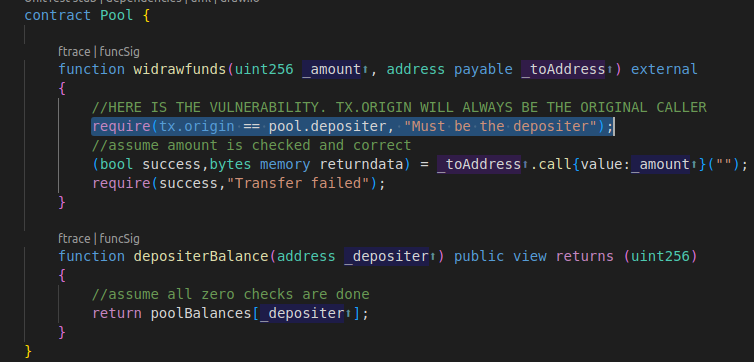
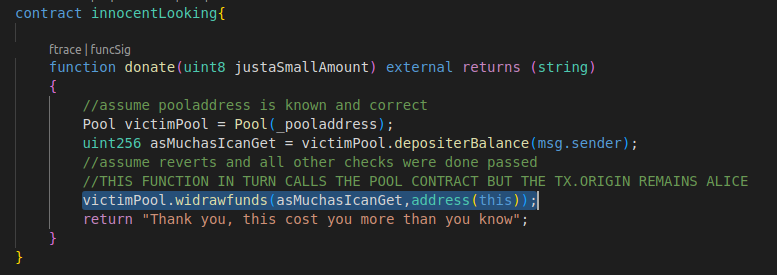

# 🎣 tx.origin Phishing Attack

## tx.origin phishing vulnerability
tx.origin and msg.sender can be used to get the address of the account making the call, however there is extra context that is vital to keep in mind.

We have 3 components in our example
1. Alice, the address of Alice's wallet in our example is 0x01 (The Depositor).
2. Bob, Bob has deployed a malicious contract in our example at address 0x02
3. The vulnerable contract, Pool, this is deployed in our example at address 0x03
<br><br>
In each scenario the Depositor address should be ```0x01``` to be able to withdraw funds from the Pool contract.<br><br>

Here is the Vulnerable contract, note the check for access control in the ```withdrawfunds()``` function uses ```tx.origin```<br><br>
<br><br>

Below is Bob's malicious contract.<br><br>
 

Let's first look at the path from Alice to the Pool contract where no malicious actions happen.
Alice calls ```widrawfunds()``` at 0x03, in this instance Alice's wallet address will be both the ```msg.sender``` and the ```tx.origin```, and therefore the funds are sent to the correct caller.<br><br>

If Bob's contract calls the Pool contract in the similar way the code at the line ```require(tx.origin == pool.depositer, "Must be the depositer");``` will receive 0x02, and the call will revert.<br><br>

Now let's take a closer look at the vulnerability, if Bob can get Alice to call the malicious contract at 0x02, and then pass the call through to the Pool contract deployed at 0x03.
- 0x01 -> calls the ```donate()``` function at 0x02
- 0x02 passes on the call to Pool function ```widrawfunds()``` at 0x03<br><br>

At this stage the ```msg.sender``` is 0x02, which should fail as it's not the original depositor, however the ```tx.origin``` is still 0x01 as the account that started the transaction will always be Alice's.<br><br>

The check that the ```tx.origin``` is the depositor will therefore pass and Bob's contract will be able to claim all the funds due to Alice.<br><br>

## Resolution
It is recommended not to use ```tx.origin``` for access control.
